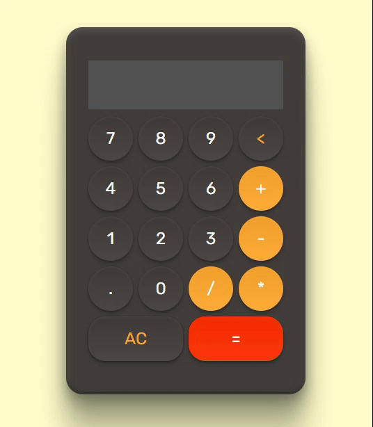

# Calculadora

Uma calculadora que trabalha com operações matemáticas simples, desenvolvida usando HTML, CSS e JavaScript.



## Índice

- [Visão Geral](#visão-geral)
- [Funcionalidades](#funcionalidades)
- [Tecnologias Utilizadas](#tecnologias-utilizadas)
- [Instalação e Uso](#instalação-e-uso)
- [Contato](#contato)

## Visão Geral

Esta é uma calculadora simples desenvolvida como um projeto de estudo para praticar HTML, CSS e JavaScript. A calculadora oferece funcionalidades básicas, incluindo adição, subtração, multiplicação e divisão.

## Funcionalidades

- Adição, subtração, multiplicação e divisão.
- Limpar o display.
- Deletar último dígito.

## Tecnologias Utilizadas

- **HTML5**: Para a estrutura da página.
- **CSS3**: Para a estilização da aplicação.
- **JavaScript**: Para a lógica da calculadora.

## Instalação e Uso

### Acesso Local
Para executar este projeto **localmente**, siga as instruções abaixo:

1. Clone o repositório:
    ```bash
    git clone https://github.com/lukaskardeck/calculadora-html-css-js.git
    ```

2. Navegue até o diretório do projeto:
    ```bash
    cd calculadora-html-css-js
    ```

3. Abra o arquivo `index.html` no seu navegador.

### Acesso Online

Você também pode acessar a aplicação **online** através do GitHub Pages: [Clique aqui!](https://lukaskardeck.github.io/calculadora-html-css-js/)

## Contato

Email - lukas.kardeck@gmail.com

Link do Projeto: https://github.com/lukaskardeck/calculadora-html-css-js

---